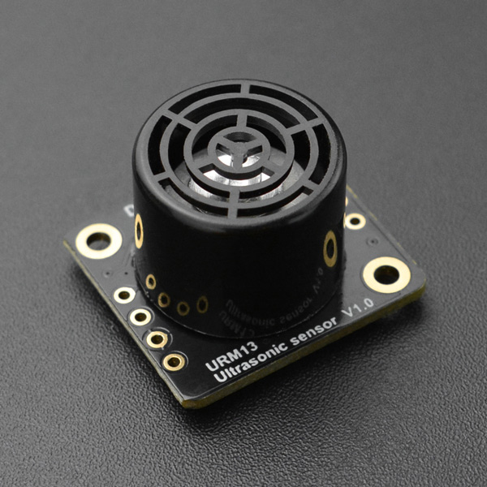

# DFRobot_URM13
* [English Version](./README.md)

URM13是一款开放式单探头超声波测距传感器, 支持TRIG脉冲触发测距（兼容SR04）、UART和I2C, 传感器可以在三种接口模式间无缝切换。该传感器尺寸紧凑、并且兼容如Arduino、树莓派等各种3.3V或5V主控板, 非常方便用户集成和应用, UART模式使用标准Modbus-RTU协议并集成了收发控制输出, 可简单通过外接RS485收发器扩展RS485接口。该传感器在保持同类传感器尺寸及重量优势的同时还具有非常出色的测距灵敏度, 使得他对于一些低声波反射率的探测目标同样具备超越同类传感器的探测性能。URM13传感器会在每次测距时自动检测环境及电源噪声并以此来动态调节测量参数, 确保它能在各种复杂应用场景之下依旧能够稳定工作。
为了满足不同的用户需求, URM13内置两段测距量程:
1、小量程15-150cm:可以实现高达50HZ的高频率探测, 适用于室内机器人避障等场景。
2、大量程40-900cm:具有卓越的测量灵敏度, 测量频率为常规10HZ, 适用于空旷场景或需要高灵敏度、高量程距离探测的场景。
实际使用时, 可通过重复触发2段量程的测距, 以实现整个量程的检测。




## 产品链接 (https://www.dfrobot.com.cn/goods-2965.html)
    SKU:SEN0352


## 目录

* [概述](#概述)
* [库安装](#库安装)
* [方法](#方法)
* [兼容性](#兼容性)
* [历史](#历史)
* [创作者](#创作者)


## 概述

* 传感器数据可以由UART(modbus-rtu)、I2C和TRIG三种接口输出, 满足多种接口环境。<br>
* 可以获取传感器基本信息、当前距离测量值和当前温度测量值。<br>
* 可以配置传感器通信地址, 测量参数等。<br>
* 为了满足不同的用户需求, URM13内置两段测距量程:小量程15-150cm; 大量程40-900cm。<br>


## 库安装

本库使用到了modbus_tk, 使用本库前先检测树莓派是否成功导入modbus_tk, 若导入失败, 请通过以下命令安装modbus_tk库
python2: pip install modbus_tk
python3: pip3 install modbus_tk

使用库, 首先下载库文件, 将其粘贴到指定的目录中, 然后打开Examples文件夹并在该文件夹中运行演示。


## 方法

```python

    '''!
      @brief Initialize sensor
      @return Return True indicate initialization succeed, return False indicate failed
    '''
    def begin(self):

    '''!
      @brief 读取模块基本信息
      @n 重新从传感器获取其基本信息, 并缓存到存储信息的变量里面:
      @n I2C接口模式: addr_I2C, PID_I2C, VID_I2C
      @n RTU接口模式: PID_RTU, VID_RTU, addr_RTU, baudrate_RTU, checkbit_RTU, stopbit_RTU
    '''
    def read_basic_info(self):

    '''!
      @brief 设置模块的通信地址, 断电保存, 重启后生效
      @param addr 要设置的设备地址, I2C地址范围(1~127即0x01~0x7F), RTU地址范围(1~247即0x0001-0x00F7)
    '''
    def set_addr(self, addr):

    '''!
      @brief 读取当前距离测量值, 测量值为零表示未测量到量程范围内的值
      @return 当前距离测量值, 单位cm, 分辨率1cm, 大量程测距范围(40 - 900cm)小量程测距范围(15-150cm)
    '''
    def get_distance_cm(self):

    '''!
      @brief 读取当前板载温度
      @return 当前板载温度值, 单位℃, 分辨率0.1℃,有符号数
    '''
    def get_internal_tempreture_C(self):

    '''!
      @brief 写入环境温度数据用于外部温度补偿
      @param temp 写入的环境温度数据, 单位℃, 分辨率0.1℃,有符号数
    '''
    def set_external_tempreture_C(self, temp=0.0):

    '''!
      @brief 设置测量相关模式
      @param mode 需要设置的测量相关模式, 下列模式经过或运算后得到mode:
      @n       E_INTERNAL_TEMP: 使用板载温度补偿功能, E_EXTERNAL_TEMP: 使用外部温度补偿功能(需用户写入外部温度)
      @n       E_TEMP_COMP_MODE_EN: 开启温度补偿功能, E_TEMP_COMP_MODE_DIS: 关闭温度补偿功能
      @n       E_AUTO_MEASURE_MODE_EN: 自动测距, E_AUTO_MEASURE_MODE_DIS: 被动测距
      @n       E_MEASURE_RANGE_MODE_LONG: 大量程测距(40 - 900cm), E_MEASURE_RANGE_MODE_SHORT: 小量程测距(15-150cm)
    '''
    def set_measure_mode(self, mode=0):

    '''!
      @brief 被动测量模式下的触发测量函数
      @n 在被动测量模式下, 调用一次此函数, 发送一次测距命令, 模块测量一次距离并将测量的距离值存入距离寄存器
    '''
    def passive_measurement_TRIG(self):

    '''!
      @brief 获取电源噪声等级, 0x00-0x0A对应噪声等级0-10
      @n 该参数能够反映供电电源以及环境对传感器的影响程度。噪声等级越小, 传感器得到的距离值将更精准。
    '''
    def get_noise_level(self):

    '''!
      @brief 测距灵敏度设置, 0x00-0x0A:灵敏度等级0-10
      @param measure_sensitivity 用于设置传感器大量程段(40-900cm)的测距灵敏度, 该值越小, 灵敏度越高, 断电保存, 立即生效
    '''
    def set_measure_sensitivity(self, measure_sensitivity):

    '''!
      @brief UART接口模式下, 设置模块的波特率, 断电保存, 重启后生效
      @param checkbit_stopbit 要设置的波特率:
             E_BAUDRATE_2400---2400, E_BAUDRATE_4800---4800, E_BAUDRATE_9600---9600, 
             E_BAUDRATE_14400---14400, E_BAUDRATE_19200---19200, E_BAUDRATE_38400---38400, 
             E_BAUDRATE_57600---57600, E_BAUDRATE_115200---115200
    '''
    def set_baudrate_mode(self, baudrate_mode=E_BAUDRATE_19200):

    '''!
      @brief UART接口模式下, 设置模块的校验位和停止位
      @param checkbit_stopbit 要设置的模式, 下列模式相与为checkbit_stopbit:
      @n      校验位:
      @n           E_CHECKBIT_NONE
      @n           E_CHECKBIT_EVEN
      @n           E_CHECKBIT_ODD
      @n      停止位:
      @n           E_STOPBIT_0P5
      @n           E_STOPBIT_1
      @n           E_STOPBIT_1P5
      @n           E_STOPBIT_2
    '''
    def set_checkbit_stopbit(self, checkbit_stopbit = E_CHECKBIT_NONE | E_STOPBIT_1):

```


## 兼容性

* RaspberryPi版本

| Board        | 正常运行  | 运行失败   | 未测试    | 备注
| ------------ | :-------: | :--------: | :------: | :-----: |
| RaspberryPi2 |           |            |    √     |         |
| RaspberryPi3 |           |            |    √     |         |
| RaspberryPi4 |     √     |            |          |         |

* Python版本

| Python  | 正常运行  | 运行失败   | 未测试    | 备注
| ------- | :-------: | :--------: | :------: | :-----: |
| Python2 |     √     |            |          |         |
| Python3 |     √     |            |          |         |


## 历史

- 2021/09/26 - 1.0.1 版本


## 创作者

Written by qsjhyy(yihuan.huang@dfrobot.com), 2021. (Welcome to our [website](https://www.dfrobot.com/))

